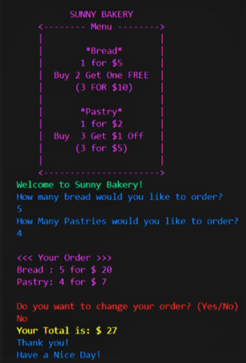

# Sunny Bakery (C# Project #1)

#### By Sue Roberts

####  C# console application for a bakery.

## Technologies Used

* C#
* .NET 5.0
* MS Test
* REPL

## Description
When the user runs this application, they are prompted with a welcome message and the cost of bread and pastries. After the user orders bread and pastries, this application will return the total cost.

*  Bread: 1 for $5, Buy 2 Get One FREE < 3 FOR $10 > 
*  Pastry:  1 for $2,  Buy 3 Get $1 Off < 3 for $5 > 

## Console View 

## Setup/Installation Requirements

* Open terminal.
* Clone this repository: $ https://github.com/SueRtx/BakeryProject.git
* Navigate to "BakeryProject": $ cd BakeryProject
* Open Vs Code: $ code .
* Open TERMINAL in Vs Code.
* Test Program: (1) $ cd Bakery.Tests  (2) $ dotnet test 
* Run Program: (1) $ cd Bakery  (2) $ dotnet run 

## Known Bugs

* none

## License

MIT

Copyright (c) 2022 Sue Roberts

